Homework 03: Use `dplyr`/`ggplot2` to manipulate and explore the `gapminder` data
================
**Shuxian Fan**
Sep 28th, 2018

Initial Package Setup
---------------------

``` r
suppressPackageStartupMessages(library(tidyverse))
suppressPackageStartupMessages(library(ggplot2))
suppressPackageStartupMessages(library(gapminder))
suppressPackageStartupMessages(library(kableExtra))
suppressPackageStartupMessages(library(gghighlight))
suppressPackageStartupMessages(library(gridExtra))
```

Exploration Tasks
-----------------

### (1) Get the maximum and minimum of GDP per capita for all continents

The table shows that Asia has the widest range of GDP per capita values, namely it has more extreme values of GDP per capita. I have highlighted it with a different color.

I also attached a useful page which has the namded color and hex equivalents for further reference. In order to highlight a certain row, I use the `kableExtra` package, where the function `row_spec` can format certain row you want.

``` r
# Using the kable_styling from the kableExtra package to do highlighting.
gap_df1 = gapminder %>%
  group_by(continent) %>%
  summarize(max.gdp = max(gdpPercap), min.gdp = min(gdpPercap))

  knitr::kable(gap_df1,"html")%>%
  kable_styling(bootstrap_options = "striped", full_width = F)%>%    
  row_spec(0, bold = T, color = "black", background = "#E6E6FA" )%>%
  row_spec(3, bold = T, color = "white", background = "darkgrey" )
```

<table class="table table-striped" style="width: auto !important; margin-left: auto; margin-right: auto;">
<thead>
<tr>
<th style="text-align:left;font-weight: bold;color: black;background-color: #E6E6FA;">
continent
</th>
<th style="text-align:right;font-weight: bold;color: black;background-color: #E6E6FA;">
max.gdp
</th>
<th style="text-align:right;font-weight: bold;color: black;background-color: #E6E6FA;">
min.gdp
</th>
</tr>
</thead>
<tbody>
<tr>
<td style="text-align:left;">
Africa
</td>
<td style="text-align:right;">
21951.21
</td>
<td style="text-align:right;">
241.1659
</td>
</tr>
<tr>
<td style="text-align:left;">
Americas
</td>
<td style="text-align:right;">
42951.65
</td>
<td style="text-align:right;">
1201.6372
</td>
</tr>
<tr>
<td style="text-align:left;font-weight: bold;color: white;background-color: darkgrey;">
Asia
</td>
<td style="text-align:right;font-weight: bold;color: white;background-color: darkgrey;">
113523.13
</td>
<td style="text-align:right;font-weight: bold;color: white;background-color: darkgrey;">
331.0000
</td>
</tr>
<tr>
<td style="text-align:left;">
Europe
</td>
<td style="text-align:right;">
49357.19
</td>
<td style="text-align:right;">
973.5332
</td>
</tr>
<tr>
<td style="text-align:left;">
Oceania
</td>
<td style="text-align:right;">
34435.37
</td>
<td style="text-align:right;">
10039.5956
</td>
</tr>
</tbody>
</table>
``` r
gap_df1%>%
  ggplot(aes(continent, max.gdp, fill = continent))+
  geom_bar(stat = "identity")+
  labs(title="Maximum of GDP per capita for continents")
```

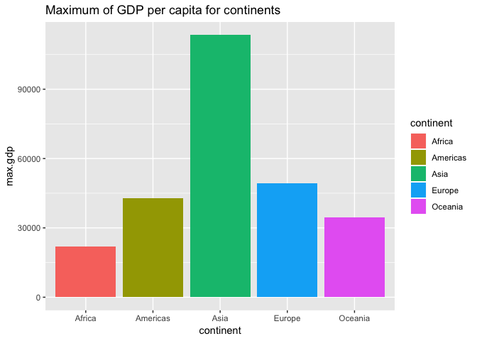

``` r
gap_df1%>%
  ggplot(aes(continent, min.gdp, fill = continent))+
  geom_bar(stat = "identity")+
  labs(title="Minimum of GDP per capita for continents")
```

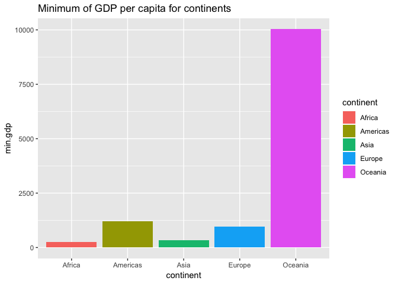

To get a intuitive sense of the maximum and minimum gdpPercap for different continents, I utilize the violin plot along with the jitter plot, where I also add a horizontal line to indicate the maximum values.

``` r
summ = 
  gapminder%>%
  group_by(continent) %>%
  summarize(max.gdp = max(gdpPercap), min.gdp = min(gdpPercap))

gapminder%>%
  ggplot(aes(continent, gdpPercap, color = continent))+
  geom_jitter(aes(alpha = 0.4))+
  geom_violin()+
  geom_hline(yintercept = summ$max.gdp, alpha = 0.2)
```

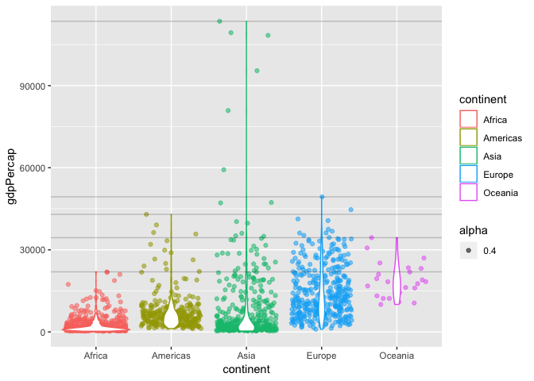

Another way to see the maximum `gdpPercap` is to present how the maximum values change through years. From this plot you also can see the trend.

``` r
  year_summ = gapminder%>%
  group_by(continent,year) %>%
  summarize(max.gdp = max(gdpPercap), min.gdp = min(gdpPercap))

year_summ%>%
  ggplot(aes(year, max.gdp, shape = continent, color = continent))+
  geom_point()+geom_line()+ 
  labs(title="The Trend of the Maximum `gdpPercap` through years")
```

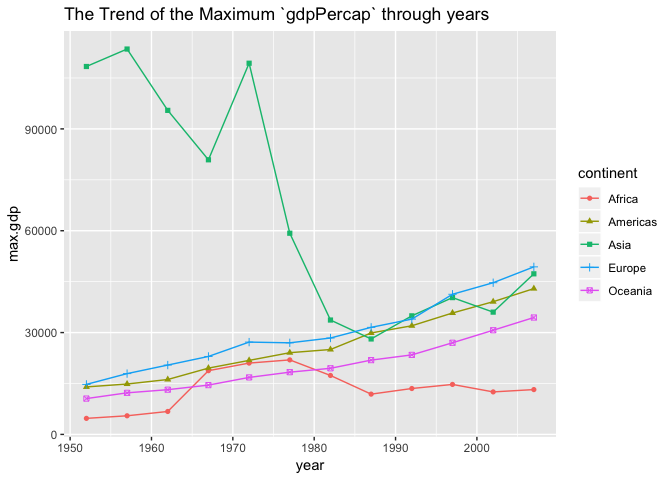

``` r
year_summ%>%
  ggplot(aes(year, min.gdp, shape = continent, color = continent))+
  geom_point()+geom_line()+ 
  labs(title="The Trend of the Minimum `gdpPercap` through years")
```

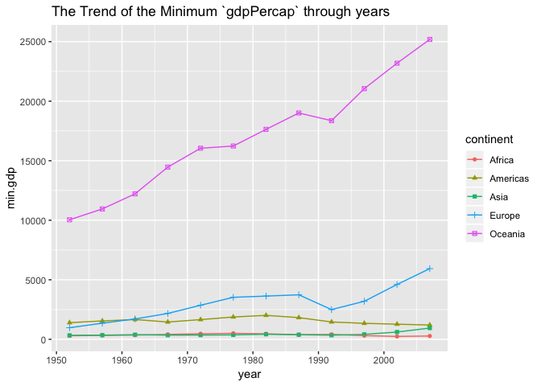

### (2) Look at the spread of GDP per capita within the continents

``` r
summary_stat = 
  gapminder %>%
  group_by(continent) %>%
  summarize(SD = sd(gdpPercap),
            IQR = IQR(gdpPercap),
            Min = min(gdpPercap), 
            Qu_1st = quantile(gdpPercap,0.25), 
            Median = median(gdpPercap), 
            Mean = mean(gdpPercap),
            Qu_3rd = quantile(gdpPercap, 0.75),
            Max = max(gdpPercap)) 
  
knitr::kable(summary_stat,"html")%>%
  kable_styling(bootstrap_options = "striped", full_width = F)%>%    
  row_spec(0, bold = T, color = "black", background = "#E6E6FA" )%>%
  column_spec(1, bold = T, color = "black", background = "#E6E6FA" )
```

<table class="table table-striped" style="width: auto !important; margin-left: auto; margin-right: auto;">
<thead>
<tr>
<th style="text-align:left;font-weight: bold;color: black;background-color: #E6E6FA;">
continent
</th>
<th style="text-align:right;font-weight: bold;color: black;background-color: #E6E6FA;">
SD
</th>
<th style="text-align:right;font-weight: bold;color: black;background-color: #E6E6FA;">
IQR
</th>
<th style="text-align:right;font-weight: bold;color: black;background-color: #E6E6FA;">
Min
</th>
<th style="text-align:right;font-weight: bold;color: black;background-color: #E6E6FA;">
Qu\_1st
</th>
<th style="text-align:right;font-weight: bold;color: black;background-color: #E6E6FA;">
Median
</th>
<th style="text-align:right;font-weight: bold;color: black;background-color: #E6E6FA;">
Mean
</th>
<th style="text-align:right;font-weight: bold;color: black;background-color: #E6E6FA;">
Qu\_3rd
</th>
<th style="text-align:right;font-weight: bold;color: black;background-color: #E6E6FA;">
Max
</th>
</tr>
</thead>
<tbody>
<tr>
<td style="text-align:left;font-weight: bold;color: black;background-color: #E6E6FA;">
Africa
</td>
<td style="text-align:right;">
2827.930
</td>
<td style="text-align:right;">
1616.170
</td>
<td style="text-align:right;">
241.1659
</td>
<td style="text-align:right;">
761.247
</td>
<td style="text-align:right;">
1192.138
</td>
<td style="text-align:right;">
2193.755
</td>
<td style="text-align:right;">
2377.417
</td>
<td style="text-align:right;">
21951.21
</td>
</tr>
<tr>
<td style="text-align:left;font-weight: bold;color: black;background-color: #E6E6FA;">
Americas
</td>
<td style="text-align:right;">
6396.764
</td>
<td style="text-align:right;">
4402.431
</td>
<td style="text-align:right;">
1201.6372
</td>
<td style="text-align:right;">
3427.779
</td>
<td style="text-align:right;">
5465.510
</td>
<td style="text-align:right;">
7136.110
</td>
<td style="text-align:right;">
7830.210
</td>
<td style="text-align:right;">
42951.65
</td>
</tr>
<tr>
<td style="text-align:left;font-weight: bold;color: black;background-color: #E6E6FA;">
Asia
</td>
<td style="text-align:right;">
14045.373
</td>
<td style="text-align:right;">
7492.262
</td>
<td style="text-align:right;">
331.0000
</td>
<td style="text-align:right;">
1056.993
</td>
<td style="text-align:right;">
2646.787
</td>
<td style="text-align:right;">
7902.150
</td>
<td style="text-align:right;">
8549.256
</td>
<td style="text-align:right;">
113523.13
</td>
</tr>
<tr>
<td style="text-align:left;font-weight: bold;color: black;background-color: #E6E6FA;">
Europe
</td>
<td style="text-align:right;">
9355.213
</td>
<td style="text-align:right;">
13248.301
</td>
<td style="text-align:right;">
973.5332
</td>
<td style="text-align:right;">
7213.085
</td>
<td style="text-align:right;">
12081.749
</td>
<td style="text-align:right;">
14469.476
</td>
<td style="text-align:right;">
20461.386
</td>
<td style="text-align:right;">
49357.19
</td>
</tr>
<tr>
<td style="text-align:left;font-weight: bold;color: black;background-color: #E6E6FA;">
Oceania
</td>
<td style="text-align:right;">
6358.983
</td>
<td style="text-align:right;">
8072.258
</td>
<td style="text-align:right;">
10039.5956
</td>
<td style="text-align:right;">
14141.859
</td>
<td style="text-align:right;">
17983.304
</td>
<td style="text-align:right;">
18621.609
</td>
<td style="text-align:right;">
22214.117
</td>
<td style="text-align:right;">
34435.37
</td>
</tr>
</tbody>
</table>
``` r
gapminder%>%
  ggplot(aes(continent, gdpPercap, fill = continent))+
  geom_boxplot(outlier.colour = "red")+
  labs(title="The Boxplots for GDP per capitla of Different Continents")
```

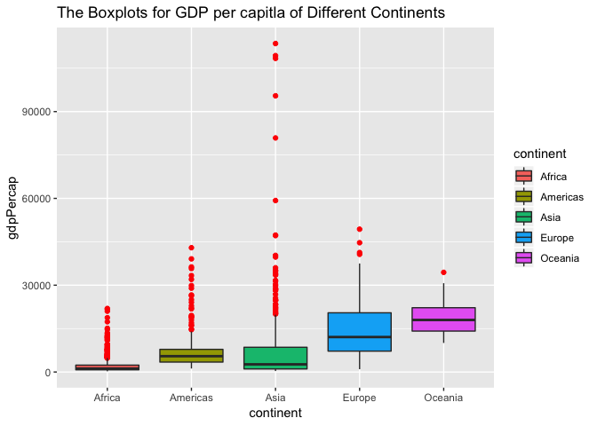

``` r
theme_set(theme_gray())
gapminder%>%
  ggplot(aes(gdpPercap, fill = continent))+
  facet_wrap(~continent,scale = "free_y")+
  geom_histogram()
```

    ## `stat_bin()` using `bins = 30`. Pick better value with `binwidth`.

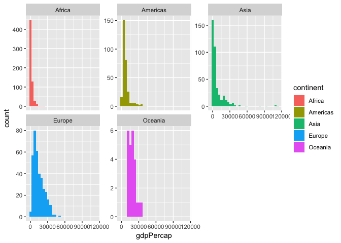

### (3) Compute a trimmed/weighted mean of life expectancy for different years.

Based on the definition of Trimmed mean, for most statistical applications, 5 − 25% of the ends are discarded. The 25% trimmed mean is known as the interquartile mean. Therefore, here I choose to present the interquartile mean of the life expectancy for different years.

``` r
trimed_df = gapminder %>%
  group_by(year) %>%    # group by year 
  summarize(mean_lifeExp = mean(lifeExp), trimed_mean_lifeExp = mean(lifeExp, trim = 0.25))%>%  
  # summarize the plain mean and trimed mean of lifeExp
  arrange(year)  # arrange by year 

weighted_df = gapminder %>%
  group_by(year) %>%    # group by year 
  summarise(mean_lifeExp = mean(lifeExp), weighted_mean_lifeExp = weighted.mean(lifeExp,pop))%>%
  arrange(year)

 knitr::kable(trimed_df,"html")%>%
  kable_styling(bootstrap_options = "striped", full_width = F)%>%    
  row_spec(0, bold = T, color = "black", background = "#E6E6FA")
```

<table class="table table-striped" style="width: auto !important; margin-left: auto; margin-right: auto;">
<thead>
<tr>
<th style="text-align:right;font-weight: bold;color: black;background-color: #E6E6FA;">
year
</th>
<th style="text-align:right;font-weight: bold;color: black;background-color: #E6E6FA;">
mean\_lifeExp
</th>
<th style="text-align:right;font-weight: bold;color: black;background-color: #E6E6FA;">
trimed\_mean\_lifeExp
</th>
</tr>
</thead>
<tbody>
<tr>
<td style="text-align:right;">
1952
</td>
<td style="text-align:right;">
49.05762
</td>
<td style="text-align:right;">
47.33607
</td>
</tr>
<tr>
<td style="text-align:right;">
1957
</td>
<td style="text-align:right;">
51.50740
</td>
<td style="text-align:right;">
50.27669
</td>
</tr>
<tr>
<td style="text-align:right;">
1962
</td>
<td style="text-align:right;">
53.60925
</td>
<td style="text-align:right;">
52.79151
</td>
</tr>
<tr>
<td style="text-align:right;">
1967
</td>
<td style="text-align:right;">
55.67829
</td>
<td style="text-align:right;">
55.43138
</td>
</tr>
<tr>
<td style="text-align:right;">
1972
</td>
<td style="text-align:right;">
57.64739
</td>
<td style="text-align:right;">
58.07853
</td>
</tr>
<tr>
<td style="text-align:right;">
1977
</td>
<td style="text-align:right;">
59.57016
</td>
<td style="text-align:right;">
60.46878
</td>
</tr>
<tr>
<td style="text-align:right;">
1982
</td>
<td style="text-align:right;">
61.53320
</td>
<td style="text-align:right;">
62.70044
</td>
</tr>
<tr>
<td style="text-align:right;">
1987
</td>
<td style="text-align:right;">
63.21261
</td>
<td style="text-align:right;">
64.76540
</td>
</tr>
<tr>
<td style="text-align:right;">
1992
</td>
<td style="text-align:right;">
64.16034
</td>
<td style="text-align:right;">
66.19274
</td>
</tr>
<tr>
<td style="text-align:right;">
1997
</td>
<td style="text-align:right;">
65.01468
</td>
<td style="text-align:right;">
67.25389
</td>
</tr>
<tr>
<td style="text-align:right;">
2002
</td>
<td style="text-align:right;">
65.69492
</td>
<td style="text-align:right;">
68.30965
</td>
</tr>
<tr>
<td style="text-align:right;">
2007
</td>
<td style="text-align:right;">
67.00742
</td>
<td style="text-align:right;">
69.68886
</td>
</tr>
</tbody>
</table>
``` r
 knitr::kable(weighted_df,"html")%>%
  kable_styling(bootstrap_options = "striped", full_width = F)%>%    
  row_spec(0, bold = T, color = "black", background = "#E6E6FA")
```

<table class="table table-striped" style="width: auto !important; margin-left: auto; margin-right: auto;">
<thead>
<tr>
<th style="text-align:right;font-weight: bold;color: black;background-color: #E6E6FA;">
year
</th>
<th style="text-align:right;font-weight: bold;color: black;background-color: #E6E6FA;">
mean\_lifeExp
</th>
<th style="text-align:right;font-weight: bold;color: black;background-color: #E6E6FA;">
weighted\_mean\_lifeExp
</th>
</tr>
</thead>
<tbody>
<tr>
<td style="text-align:right;">
1952
</td>
<td style="text-align:right;">
49.05762
</td>
<td style="text-align:right;">
48.94424
</td>
</tr>
<tr>
<td style="text-align:right;">
1957
</td>
<td style="text-align:right;">
51.50740
</td>
<td style="text-align:right;">
52.12189
</td>
</tr>
<tr>
<td style="text-align:right;">
1962
</td>
<td style="text-align:right;">
53.60925
</td>
<td style="text-align:right;">
52.32438
</td>
</tr>
<tr>
<td style="text-align:right;">
1967
</td>
<td style="text-align:right;">
55.67829
</td>
<td style="text-align:right;">
56.98431
</td>
</tr>
<tr>
<td style="text-align:right;">
1972
</td>
<td style="text-align:right;">
57.64739
</td>
<td style="text-align:right;">
59.51478
</td>
</tr>
<tr>
<td style="text-align:right;">
1977
</td>
<td style="text-align:right;">
59.57016
</td>
<td style="text-align:right;">
61.23726
</td>
</tr>
<tr>
<td style="text-align:right;">
1982
</td>
<td style="text-align:right;">
61.53320
</td>
<td style="text-align:right;">
62.88176
</td>
</tr>
<tr>
<td style="text-align:right;">
1987
</td>
<td style="text-align:right;">
63.21261
</td>
<td style="text-align:right;">
64.41635
</td>
</tr>
<tr>
<td style="text-align:right;">
1992
</td>
<td style="text-align:right;">
64.16034
</td>
<td style="text-align:right;">
65.64590
</td>
</tr>
<tr>
<td style="text-align:right;">
1997
</td>
<td style="text-align:right;">
65.01468
</td>
<td style="text-align:right;">
66.84934
</td>
</tr>
<tr>
<td style="text-align:right;">
2002
</td>
<td style="text-align:right;">
65.69492
</td>
<td style="text-align:right;">
67.83904
</td>
</tr>
<tr>
<td style="text-align:right;">
2007
</td>
<td style="text-align:right;">
67.00742
</td>
<td style="text-align:right;">
68.91909
</td>
</tr>
</tbody>
</table>
To see how the trimed and weighted mean evolve through years, I used a point plot with line added to illustrate the table above.

``` r
ggplot(trimed_df, aes(year,trimed_mean_lifeExp))+
  geom_point(color = "red")+
  geom_line(color = "red")+
  geom_point(aes(year,mean_lifeExp))+
  geom_line(aes(year,mean_lifeExp))
```

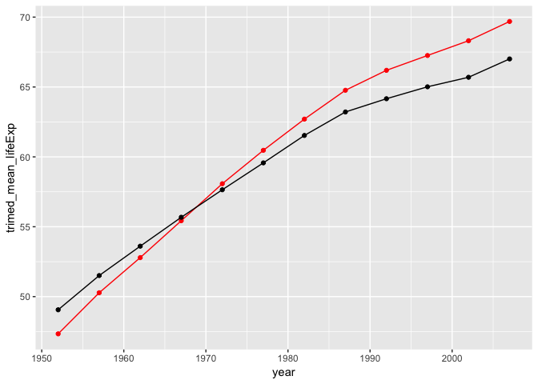

``` r
ggplot(weighted_df, aes(year,weighted_mean_lifeExp))+
  geom_point(color = "red")+
  geom_line(color = "red")+
  geom_point(aes(year,mean_lifeExp))+
  geom_line(aes(year,mean_lifeExp))
```

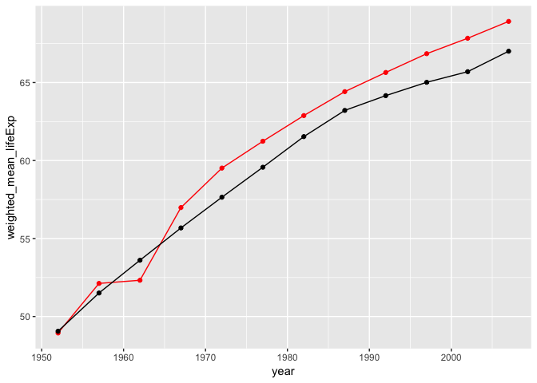

### (4) How is life expectancy changing over time on different continents?

The table is too long to present so I made a scroll box using the great feature in the `kableExtra` package.

``` r
lifeExp_df = gapminder %>%
  group_by(continent, year) %>%
  summarise(mean_lifeExp = mean(lifeExp))
  
knitr::kable(lifeExp_df,"html")%>%
  kable_styling(bootstrap_options = "striped", full_width = F)%>%    
  row_spec(0, bold = T, color = "black", background = "#E6E6FA" )%>%
  scroll_box(width = "400px", height = "400px")
```

<table class="table table-striped" style="width: auto !important; margin-left: auto; margin-right: auto;">
<thead>
<tr>
<th style="text-align:left;font-weight: bold;color: black;background-color: #E6E6FA;">
continent
</th>
<th style="text-align:right;font-weight: bold;color: black;background-color: #E6E6FA;">
year
</th>
<th style="text-align:right;font-weight: bold;color: black;background-color: #E6E6FA;">
mean\_lifeExp
</th>
</tr>
</thead>
<tbody>
<tr>
<td style="text-align:left;">
Africa
</td>
<td style="text-align:right;">
1952
</td>
<td style="text-align:right;">
39.13550
</td>
</tr>
<tr>
<td style="text-align:left;">
Africa
</td>
<td style="text-align:right;">
1957
</td>
<td style="text-align:right;">
41.26635
</td>
</tr>
<tr>
<td style="text-align:left;">
Africa
</td>
<td style="text-align:right;">
1962
</td>
<td style="text-align:right;">
43.31944
</td>
</tr>
<tr>
<td style="text-align:left;">
Africa
</td>
<td style="text-align:right;">
1967
</td>
<td style="text-align:right;">
45.33454
</td>
</tr>
<tr>
<td style="text-align:left;">
Africa
</td>
<td style="text-align:right;">
1972
</td>
<td style="text-align:right;">
47.45094
</td>
</tr>
<tr>
<td style="text-align:left;">
Africa
</td>
<td style="text-align:right;">
1977
</td>
<td style="text-align:right;">
49.58042
</td>
</tr>
<tr>
<td style="text-align:left;">
Africa
</td>
<td style="text-align:right;">
1982
</td>
<td style="text-align:right;">
51.59287
</td>
</tr>
<tr>
<td style="text-align:left;">
Africa
</td>
<td style="text-align:right;">
1987
</td>
<td style="text-align:right;">
53.34479
</td>
</tr>
<tr>
<td style="text-align:left;">
Africa
</td>
<td style="text-align:right;">
1992
</td>
<td style="text-align:right;">
53.62958
</td>
</tr>
<tr>
<td style="text-align:left;">
Africa
</td>
<td style="text-align:right;">
1997
</td>
<td style="text-align:right;">
53.59827
</td>
</tr>
<tr>
<td style="text-align:left;">
Africa
</td>
<td style="text-align:right;">
2002
</td>
<td style="text-align:right;">
53.32523
</td>
</tr>
<tr>
<td style="text-align:left;">
Africa
</td>
<td style="text-align:right;">
2007
</td>
<td style="text-align:right;">
54.80604
</td>
</tr>
<tr>
<td style="text-align:left;">
Americas
</td>
<td style="text-align:right;">
1952
</td>
<td style="text-align:right;">
53.27984
</td>
</tr>
<tr>
<td style="text-align:left;">
Americas
</td>
<td style="text-align:right;">
1957
</td>
<td style="text-align:right;">
55.96028
</td>
</tr>
<tr>
<td style="text-align:left;">
Americas
</td>
<td style="text-align:right;">
1962
</td>
<td style="text-align:right;">
58.39876
</td>
</tr>
<tr>
<td style="text-align:left;">
Americas
</td>
<td style="text-align:right;">
1967
</td>
<td style="text-align:right;">
60.41092
</td>
</tr>
<tr>
<td style="text-align:left;">
Americas
</td>
<td style="text-align:right;">
1972
</td>
<td style="text-align:right;">
62.39492
</td>
</tr>
<tr>
<td style="text-align:left;">
Americas
</td>
<td style="text-align:right;">
1977
</td>
<td style="text-align:right;">
64.39156
</td>
</tr>
<tr>
<td style="text-align:left;">
Americas
</td>
<td style="text-align:right;">
1982
</td>
<td style="text-align:right;">
66.22884
</td>
</tr>
<tr>
<td style="text-align:left;">
Americas
</td>
<td style="text-align:right;">
1987
</td>
<td style="text-align:right;">
68.09072
</td>
</tr>
<tr>
<td style="text-align:left;">
Americas
</td>
<td style="text-align:right;">
1992
</td>
<td style="text-align:right;">
69.56836
</td>
</tr>
<tr>
<td style="text-align:left;">
Americas
</td>
<td style="text-align:right;">
1997
</td>
<td style="text-align:right;">
71.15048
</td>
</tr>
<tr>
<td style="text-align:left;">
Americas
</td>
<td style="text-align:right;">
2002
</td>
<td style="text-align:right;">
72.42204
</td>
</tr>
<tr>
<td style="text-align:left;">
Americas
</td>
<td style="text-align:right;">
2007
</td>
<td style="text-align:right;">
73.60812
</td>
</tr>
<tr>
<td style="text-align:left;">
Asia
</td>
<td style="text-align:right;">
1952
</td>
<td style="text-align:right;">
46.31439
</td>
</tr>
<tr>
<td style="text-align:left;">
Asia
</td>
<td style="text-align:right;">
1957
</td>
<td style="text-align:right;">
49.31854
</td>
</tr>
<tr>
<td style="text-align:left;">
Asia
</td>
<td style="text-align:right;">
1962
</td>
<td style="text-align:right;">
51.56322
</td>
</tr>
<tr>
<td style="text-align:left;">
Asia
</td>
<td style="text-align:right;">
1967
</td>
<td style="text-align:right;">
54.66364
</td>
</tr>
<tr>
<td style="text-align:left;">
Asia
</td>
<td style="text-align:right;">
1972
</td>
<td style="text-align:right;">
57.31927
</td>
</tr>
<tr>
<td style="text-align:left;">
Asia
</td>
<td style="text-align:right;">
1977
</td>
<td style="text-align:right;">
59.61056
</td>
</tr>
<tr>
<td style="text-align:left;">
Asia
</td>
<td style="text-align:right;">
1982
</td>
<td style="text-align:right;">
62.61794
</td>
</tr>
<tr>
<td style="text-align:left;">
Asia
</td>
<td style="text-align:right;">
1987
</td>
<td style="text-align:right;">
64.85118
</td>
</tr>
<tr>
<td style="text-align:left;">
Asia
</td>
<td style="text-align:right;">
1992
</td>
<td style="text-align:right;">
66.53721
</td>
</tr>
<tr>
<td style="text-align:left;">
Asia
</td>
<td style="text-align:right;">
1997
</td>
<td style="text-align:right;">
68.02052
</td>
</tr>
<tr>
<td style="text-align:left;">
Asia
</td>
<td style="text-align:right;">
2002
</td>
<td style="text-align:right;">
69.23388
</td>
</tr>
<tr>
<td style="text-align:left;">
Asia
</td>
<td style="text-align:right;">
2007
</td>
<td style="text-align:right;">
70.72848
</td>
</tr>
<tr>
<td style="text-align:left;">
Europe
</td>
<td style="text-align:right;">
1952
</td>
<td style="text-align:right;">
64.40850
</td>
</tr>
<tr>
<td style="text-align:left;">
Europe
</td>
<td style="text-align:right;">
1957
</td>
<td style="text-align:right;">
66.70307
</td>
</tr>
<tr>
<td style="text-align:left;">
Europe
</td>
<td style="text-align:right;">
1962
</td>
<td style="text-align:right;">
68.53923
</td>
</tr>
<tr>
<td style="text-align:left;">
Europe
</td>
<td style="text-align:right;">
1967
</td>
<td style="text-align:right;">
69.73760
</td>
</tr>
<tr>
<td style="text-align:left;">
Europe
</td>
<td style="text-align:right;">
1972
</td>
<td style="text-align:right;">
70.77503
</td>
</tr>
<tr>
<td style="text-align:left;">
Europe
</td>
<td style="text-align:right;">
1977
</td>
<td style="text-align:right;">
71.93777
</td>
</tr>
<tr>
<td style="text-align:left;">
Europe
</td>
<td style="text-align:right;">
1982
</td>
<td style="text-align:right;">
72.80640
</td>
</tr>
<tr>
<td style="text-align:left;">
Europe
</td>
<td style="text-align:right;">
1987
</td>
<td style="text-align:right;">
73.64217
</td>
</tr>
<tr>
<td style="text-align:left;">
Europe
</td>
<td style="text-align:right;">
1992
</td>
<td style="text-align:right;">
74.44010
</td>
</tr>
<tr>
<td style="text-align:left;">
Europe
</td>
<td style="text-align:right;">
1997
</td>
<td style="text-align:right;">
75.50517
</td>
</tr>
<tr>
<td style="text-align:left;">
Europe
</td>
<td style="text-align:right;">
2002
</td>
<td style="text-align:right;">
76.70060
</td>
</tr>
<tr>
<td style="text-align:left;">
Europe
</td>
<td style="text-align:right;">
2007
</td>
<td style="text-align:right;">
77.64860
</td>
</tr>
<tr>
<td style="text-align:left;">
Oceania
</td>
<td style="text-align:right;">
1952
</td>
<td style="text-align:right;">
69.25500
</td>
</tr>
<tr>
<td style="text-align:left;">
Oceania
</td>
<td style="text-align:right;">
1957
</td>
<td style="text-align:right;">
70.29500
</td>
</tr>
<tr>
<td style="text-align:left;">
Oceania
</td>
<td style="text-align:right;">
1962
</td>
<td style="text-align:right;">
71.08500
</td>
</tr>
<tr>
<td style="text-align:left;">
Oceania
</td>
<td style="text-align:right;">
1967
</td>
<td style="text-align:right;">
71.31000
</td>
</tr>
<tr>
<td style="text-align:left;">
Oceania
</td>
<td style="text-align:right;">
1972
</td>
<td style="text-align:right;">
71.91000
</td>
</tr>
<tr>
<td style="text-align:left;">
Oceania
</td>
<td style="text-align:right;">
1977
</td>
<td style="text-align:right;">
72.85500
</td>
</tr>
<tr>
<td style="text-align:left;">
Oceania
</td>
<td style="text-align:right;">
1982
</td>
<td style="text-align:right;">
74.29000
</td>
</tr>
<tr>
<td style="text-align:left;">
Oceania
</td>
<td style="text-align:right;">
1987
</td>
<td style="text-align:right;">
75.32000
</td>
</tr>
<tr>
<td style="text-align:left;">
Oceania
</td>
<td style="text-align:right;">
1992
</td>
<td style="text-align:right;">
76.94500
</td>
</tr>
<tr>
<td style="text-align:left;">
Oceania
</td>
<td style="text-align:right;">
1997
</td>
<td style="text-align:right;">
78.19000
</td>
</tr>
<tr>
<td style="text-align:left;">
Oceania
</td>
<td style="text-align:right;">
2002
</td>
<td style="text-align:right;">
79.74000
</td>
</tr>
<tr>
<td style="text-align:left;">
Oceania
</td>
<td style="text-align:right;">
2007
</td>
<td style="text-align:right;">
80.71950
</td>
</tr>
</tbody>
</table>

To depict how the mean life expectancy change over time, I plot the point along with a linear regression function to capture the trend.

``` r
lifeExp_df %>%
  ggplot(aes(year, mean_lifeExp, color = continent))+
  geom_point()+geom_smooth(method = "lm")
```

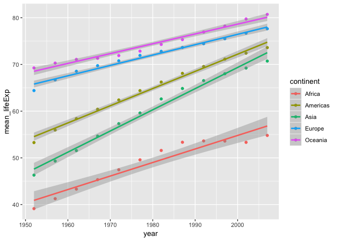

``` r
# plot the distribution of each continent.
ggplot(gapminder, aes(year,lifeExp))+
  facet_wrap(~continent)+geom_point(alpha = 0.2)+geom_smooth()
```

    ## `geom_smooth()` using method = 'loess' and formula 'y ~ x'

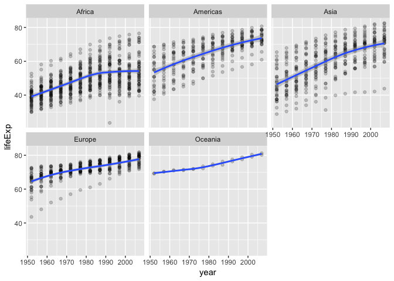

### (5) Report the absolute and/or relative abundance of countries with low life expectancy over time by continent

First, to decide the bench mark of low life expectancey, I choose to take a look at the spread of life expectancy for different continent. From the table below, I decide to choose the mean of first quantiles as the bench mark. After rounding it to the nearest integer, the number is 59.

``` r
summary_stat_lifeExp = 
  gapminder %>%
  group_by(continent) %>%
  summarize(SD = sd(lifeExp),
            IQR = IQR(lifeExp),
            Min = min(lifeExp), 
            Qu_1st = quantile(lifeExp,0.25), 
            Median = median(lifeExp), 
            Mean = mean(lifeExp),
            Qu_3rd = quantile(lifeExp, 0.75),
            Max = max(lifeExp)) 
  
knitr::kable(summary_stat_lifeExp,"html")%>%
  kable_styling(bootstrap_options = "striped", full_width = F)%>%    
  row_spec(0, bold = T, color = "black", background = "#E6E6FA" )%>%
  column_spec(1, bold = T, color = "black", background = "#E6E6FA" )
```

<table class="table table-striped" style="width: auto !important; margin-left: auto; margin-right: auto;">
<thead>
<tr>
<th style="text-align:left;font-weight: bold;color: black;background-color: #E6E6FA;">
continent
</th>
<th style="text-align:right;font-weight: bold;color: black;background-color: #E6E6FA;">
SD
</th>
<th style="text-align:right;font-weight: bold;color: black;background-color: #E6E6FA;">
IQR
</th>
<th style="text-align:right;font-weight: bold;color: black;background-color: #E6E6FA;">
Min
</th>
<th style="text-align:right;font-weight: bold;color: black;background-color: #E6E6FA;">
Qu\_1st
</th>
<th style="text-align:right;font-weight: bold;color: black;background-color: #E6E6FA;">
Median
</th>
<th style="text-align:right;font-weight: bold;color: black;background-color: #E6E6FA;">
Mean
</th>
<th style="text-align:right;font-weight: bold;color: black;background-color: #E6E6FA;">
Qu\_3rd
</th>
<th style="text-align:right;font-weight: bold;color: black;background-color: #E6E6FA;">
Max
</th>
</tr>
</thead>
<tbody>
<tr>
<td style="text-align:left;font-weight: bold;color: black;background-color: #E6E6FA;">
Africa
</td>
<td style="text-align:right;">
9.150210
</td>
<td style="text-align:right;">
12.0390
</td>
<td style="text-align:right;">
23.599
</td>
<td style="text-align:right;">
42.37250
</td>
<td style="text-align:right;">
47.7920
</td>
<td style="text-align:right;">
48.86533
</td>
<td style="text-align:right;">
54.41150
</td>
<td style="text-align:right;">
76.442
</td>
</tr>
<tr>
<td style="text-align:left;font-weight: bold;color: black;background-color: #E6E6FA;">
Americas
</td>
<td style="text-align:right;">
9.345088
</td>
<td style="text-align:right;">
13.2895
</td>
<td style="text-align:right;">
37.579
</td>
<td style="text-align:right;">
58.41000
</td>
<td style="text-align:right;">
67.0480
</td>
<td style="text-align:right;">
64.65874
</td>
<td style="text-align:right;">
71.69950
</td>
<td style="text-align:right;">
80.653
</td>
</tr>
<tr>
<td style="text-align:left;font-weight: bold;color: black;background-color: #E6E6FA;">
Asia
</td>
<td style="text-align:right;">
11.864532
</td>
<td style="text-align:right;">
18.0790
</td>
<td style="text-align:right;">
28.801
</td>
<td style="text-align:right;">
51.42625
</td>
<td style="text-align:right;">
61.7915
</td>
<td style="text-align:right;">
60.06490
</td>
<td style="text-align:right;">
69.50525
</td>
<td style="text-align:right;">
82.603
</td>
</tr>
<tr>
<td style="text-align:left;font-weight: bold;color: black;background-color: #E6E6FA;">
Europe
</td>
<td style="text-align:right;">
5.433178
</td>
<td style="text-align:right;">
5.8805
</td>
<td style="text-align:right;">
43.585
</td>
<td style="text-align:right;">
69.57000
</td>
<td style="text-align:right;">
72.2410
</td>
<td style="text-align:right;">
71.90369
</td>
<td style="text-align:right;">
75.45050
</td>
<td style="text-align:right;">
81.757
</td>
</tr>
<tr>
<td style="text-align:left;font-weight: bold;color: black;background-color: #E6E6FA;">
Oceania
</td>
<td style="text-align:right;">
3.795611
</td>
<td style="text-align:right;">
6.3475
</td>
<td style="text-align:right;">
69.120
</td>
<td style="text-align:right;">
71.20500
</td>
<td style="text-align:right;">
73.6650
</td>
<td style="text-align:right;">
74.32621
</td>
<td style="text-align:right;">
77.55250
</td>
<td style="text-align:right;">
81.235
</td>
</tr>
</tbody>
</table>
``` r
benchmark = round(mean(summary_stat_lifeExp$Qu_1st))
```

``` r
low_lifeExp = 
  gapminder %>%
  group_by(continent, year) %>%
  summarize(low_life_exp_percent =round(sum(lifeExp < 57)/length(lifeExp),2)) %>%
  arrange(year)


  knitr::kable(low_lifeExp,"html")%>%
  kable_styling(bootstrap_options = "striped", full_width = F)%>%    
  row_spec(0, bold = T, color = "black", background = "#E6E6FA" )%>%
  scroll_box(width = "400px", height = "400px") 
```

<table class="table table-striped" style="width: auto !important; margin-left: auto; margin-right: auto;">
<thead>
<tr>
<th style="text-align:left;font-weight: bold;color: black;background-color: #E6E6FA;">
continent
</th>
<th style="text-align:right;font-weight: bold;color: black;background-color: #E6E6FA;">
year
</th>
<th style="text-align:right;font-weight: bold;color: black;background-color: #E6E6FA;">
low\_life\_exp\_percent
</th>
</tr>
</thead>
<tbody>
<tr>
<td style="text-align:left;">
Africa
</td>
<td style="text-align:right;">
1952
</td>
<td style="text-align:right;">
1.00
</td>
</tr>
<tr>
<td style="text-align:left;">
Americas
</td>
<td style="text-align:right;">
1952
</td>
<td style="text-align:right;">
0.60
</td>
</tr>
<tr>
<td style="text-align:left;">
Asia
</td>
<td style="text-align:right;">
1952
</td>
<td style="text-align:right;">
0.82
</td>
</tr>
<tr>
<td style="text-align:left;">
Europe
</td>
<td style="text-align:right;">
1952
</td>
<td style="text-align:right;">
0.10
</td>
</tr>
<tr>
<td style="text-align:left;">
Oceania
</td>
<td style="text-align:right;">
1952
</td>
<td style="text-align:right;">
0.00
</td>
</tr>
<tr>
<td style="text-align:left;">
Africa
</td>
<td style="text-align:right;">
1957
</td>
<td style="text-align:right;">
0.98
</td>
</tr>
<tr>
<td style="text-align:left;">
Americas
</td>
<td style="text-align:right;">
1957
</td>
<td style="text-align:right;">
0.52
</td>
</tr>
<tr>
<td style="text-align:left;">
Asia
</td>
<td style="text-align:right;">
1957
</td>
<td style="text-align:right;">
0.76
</td>
</tr>
<tr>
<td style="text-align:left;">
Europe
</td>
<td style="text-align:right;">
1957
</td>
<td style="text-align:right;">
0.03
</td>
</tr>
<tr>
<td style="text-align:left;">
Oceania
</td>
<td style="text-align:right;">
1957
</td>
<td style="text-align:right;">
0.00
</td>
</tr>
<tr>
<td style="text-align:left;">
Africa
</td>
<td style="text-align:right;">
1962
</td>
<td style="text-align:right;">
0.96
</td>
</tr>
<tr>
<td style="text-align:left;">
Americas
</td>
<td style="text-align:right;">
1962
</td>
<td style="text-align:right;">
0.40
</td>
</tr>
<tr>
<td style="text-align:left;">
Asia
</td>
<td style="text-align:right;">
1962
</td>
<td style="text-align:right;">
0.76
</td>
</tr>
<tr>
<td style="text-align:left;">
Europe
</td>
<td style="text-align:right;">
1962
</td>
<td style="text-align:right;">
0.03
</td>
</tr>
<tr>
<td style="text-align:left;">
Oceania
</td>
<td style="text-align:right;">
1962
</td>
<td style="text-align:right;">
0.00
</td>
</tr>
<tr>
<td style="text-align:left;">
Africa
</td>
<td style="text-align:right;">
1967
</td>
<td style="text-align:right;">
0.96
</td>
</tr>
<tr>
<td style="text-align:left;">
Americas
</td>
<td style="text-align:right;">
1967
</td>
<td style="text-align:right;">
0.36
</td>
</tr>
<tr>
<td style="text-align:left;">
Asia
</td>
<td style="text-align:right;">
1967
</td>
<td style="text-align:right;">
0.58
</td>
</tr>
<tr>
<td style="text-align:left;">
Europe
</td>
<td style="text-align:right;">
1967
</td>
<td style="text-align:right;">
0.03
</td>
</tr>
<tr>
<td style="text-align:left;">
Oceania
</td>
<td style="text-align:right;">
1967
</td>
<td style="text-align:right;">
0.00
</td>
</tr>
<tr>
<td style="text-align:left;">
Africa
</td>
<td style="text-align:right;">
1972
</td>
<td style="text-align:right;">
0.96
</td>
</tr>
<tr>
<td style="text-align:left;">
Americas
</td>
<td style="text-align:right;">
1972
</td>
<td style="text-align:right;">
0.24
</td>
</tr>
<tr>
<td style="text-align:left;">
Asia
</td>
<td style="text-align:right;">
1972
</td>
<td style="text-align:right;">
0.52
</td>
</tr>
<tr>
<td style="text-align:left;">
Europe
</td>
<td style="text-align:right;">
1972
</td>
<td style="text-align:right;">
0.00
</td>
</tr>
<tr>
<td style="text-align:left;">
Oceania
</td>
<td style="text-align:right;">
1972
</td>
<td style="text-align:right;">
0.00
</td>
</tr>
<tr>
<td style="text-align:left;">
Africa
</td>
<td style="text-align:right;">
1977
</td>
<td style="text-align:right;">
0.85
</td>
</tr>
<tr>
<td style="text-align:left;">
Americas
</td>
<td style="text-align:right;">
1977
</td>
<td style="text-align:right;">
0.16
</td>
</tr>
<tr>
<td style="text-align:left;">
Asia
</td>
<td style="text-align:right;">
1977
</td>
<td style="text-align:right;">
0.33
</td>
</tr>
<tr>
<td style="text-align:left;">
Europe
</td>
<td style="text-align:right;">
1977
</td>
<td style="text-align:right;">
0.00
</td>
</tr>
<tr>
<td style="text-align:left;">
Oceania
</td>
<td style="text-align:right;">
1977
</td>
<td style="text-align:right;">
0.00
</td>
</tr>
<tr>
<td style="text-align:left;">
Africa
</td>
<td style="text-align:right;">
1982
</td>
<td style="text-align:right;">
0.77
</td>
</tr>
<tr>
<td style="text-align:left;">
Americas
</td>
<td style="text-align:right;">
1982
</td>
<td style="text-align:right;">
0.12
</td>
</tr>
<tr>
<td style="text-align:left;">
Asia
</td>
<td style="text-align:right;">
1982
</td>
<td style="text-align:right;">
0.24
</td>
</tr>
<tr>
<td style="text-align:left;">
Europe
</td>
<td style="text-align:right;">
1982
</td>
<td style="text-align:right;">
0.00
</td>
</tr>
<tr>
<td style="text-align:left;">
Oceania
</td>
<td style="text-align:right;">
1982
</td>
<td style="text-align:right;">
0.00
</td>
</tr>
<tr>
<td style="text-align:left;">
Africa
</td>
<td style="text-align:right;">
1987
</td>
<td style="text-align:right;">
0.67
</td>
</tr>
<tr>
<td style="text-align:left;">
Americas
</td>
<td style="text-align:right;">
1987
</td>
<td style="text-align:right;">
0.04
</td>
</tr>
<tr>
<td style="text-align:left;">
Asia
</td>
<td style="text-align:right;">
1987
</td>
<td style="text-align:right;">
0.15
</td>
</tr>
<tr>
<td style="text-align:left;">
Europe
</td>
<td style="text-align:right;">
1987
</td>
<td style="text-align:right;">
0.00
</td>
</tr>
<tr>
<td style="text-align:left;">
Oceania
</td>
<td style="text-align:right;">
1987
</td>
<td style="text-align:right;">
0.00
</td>
</tr>
<tr>
<td style="text-align:left;">
Africa
</td>
<td style="text-align:right;">
1992
</td>
<td style="text-align:right;">
0.60
</td>
</tr>
<tr>
<td style="text-align:left;">
Americas
</td>
<td style="text-align:right;">
1992
</td>
<td style="text-align:right;">
0.04
</td>
</tr>
<tr>
<td style="text-align:left;">
Asia
</td>
<td style="text-align:right;">
1992
</td>
<td style="text-align:right;">
0.15
</td>
</tr>
<tr>
<td style="text-align:left;">
Europe
</td>
<td style="text-align:right;">
1992
</td>
<td style="text-align:right;">
0.00
</td>
</tr>
<tr>
<td style="text-align:left;">
Oceania
</td>
<td style="text-align:right;">
1992
</td>
<td style="text-align:right;">
0.00
</td>
</tr>
<tr>
<td style="text-align:left;">
Africa
</td>
<td style="text-align:right;">
1997
</td>
<td style="text-align:right;">
0.69
</td>
</tr>
<tr>
<td style="text-align:left;">
Americas
</td>
<td style="text-align:right;">
1997
</td>
<td style="text-align:right;">
0.04
</td>
</tr>
<tr>
<td style="text-align:left;">
Asia
</td>
<td style="text-align:right;">
1997
</td>
<td style="text-align:right;">
0.06
</td>
</tr>
<tr>
<td style="text-align:left;">
Europe
</td>
<td style="text-align:right;">
1997
</td>
<td style="text-align:right;">
0.00
</td>
</tr>
<tr>
<td style="text-align:left;">
Oceania
</td>
<td style="text-align:right;">
1997
</td>
<td style="text-align:right;">
0.00
</td>
</tr>
<tr>
<td style="text-align:left;">
Africa
</td>
<td style="text-align:right;">
2002
</td>
<td style="text-align:right;">
0.71
</td>
</tr>
<tr>
<td style="text-align:left;">
Americas
</td>
<td style="text-align:right;">
2002
</td>
<td style="text-align:right;">
0.00
</td>
</tr>
<tr>
<td style="text-align:left;">
Asia
</td>
<td style="text-align:right;">
2002
</td>
<td style="text-align:right;">
0.06
</td>
</tr>
<tr>
<td style="text-align:left;">
Europe
</td>
<td style="text-align:right;">
2002
</td>
<td style="text-align:right;">
0.00
</td>
</tr>
<tr>
<td style="text-align:left;">
Oceania
</td>
<td style="text-align:right;">
2002
</td>
<td style="text-align:right;">
0.00
</td>
</tr>
<tr>
<td style="text-align:left;">
Africa
</td>
<td style="text-align:right;">
2007
</td>
<td style="text-align:right;">
0.67
</td>
</tr>
<tr>
<td style="text-align:left;">
Americas
</td>
<td style="text-align:right;">
2007
</td>
<td style="text-align:right;">
0.00
</td>
</tr>
<tr>
<td style="text-align:left;">
Asia
</td>
<td style="text-align:right;">
2007
</td>
<td style="text-align:right;">
0.03
</td>
</tr>
<tr>
<td style="text-align:left;">
Europe
</td>
<td style="text-align:right;">
2007
</td>
<td style="text-align:right;">
0.00
</td>
</tr>
<tr>
<td style="text-align:left;">
Oceania
</td>
<td style="text-align:right;">
2007
</td>
<td style="text-align:right;">
0.00
</td>
</tr>
</tbody>
</table>

``` r
ggplot(low_lifeExp, aes(year, low_life_exp_percent))+
  geom_point()+
  geom_line(aes(color = continent))+
   labs(title="Percentage of countries with low life Expectancy over time for all continents")
```

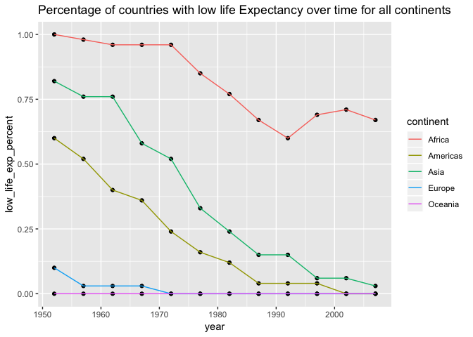

From the plot we can see that, None of the countries in the continent Oceania have low expectancy. Through years, Europe and America no longer have countries with low expectancy. Asia is very close to raise the life expectancy to our benchmark while Africa still have a greater percent of the coutries that have low life expectancy.

Reference and Sources
---------------------

**1. Named Colors and Hex Equivalents** <https://css-tricks.com/snippets/css/named-colors-and-hex-equivalents/>

**2. Emoji Cheat Sheet** <https://www.webpagefx.com/tools/emoji-cheat-sheet/>

**3. Truncated Mean** <https://en.wikipedia.org/wiki/Truncated_mean>

**4. Create Awesome HTML Table with knitr::kable and kableExtra** <https://haozhu233.github.io/kableExtra/awesome_table_in_html.html>
